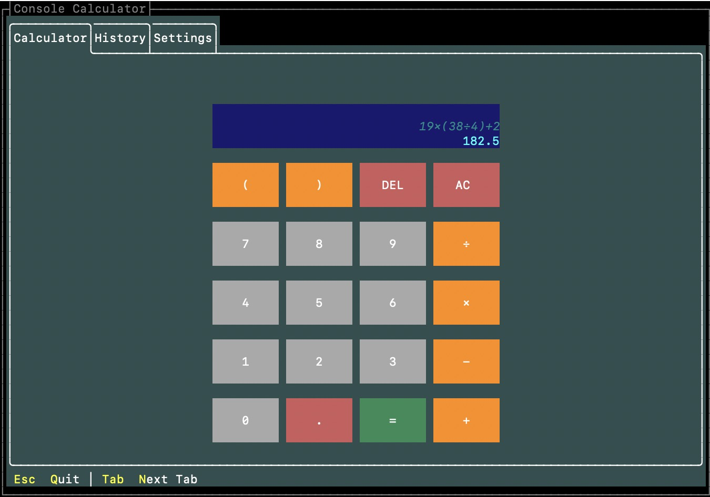

# Console Calculator Pro

An interactive console-based calculator built as part of [The C# Academy](https://www.thecsharpacademy.com/) curriculum. The goal is to practice C# console application development.



---

## Features

- **Interactive TUI:** Powered by `Terminal.Gui`, the application renders a fully interactive, mouse-friendly interface directly in the terminal — tabs, styled buttons, and a dual-line display included.
- **Complex expression evaluation:** Powered by `NCalc`, supports operator precedence, parentheses, and localized operators (e.g. `19×(38÷4)+2`). Results are formatted to up to 8 decimal places.
- **Keyboard support:** Full keyboard input — digits, operators, `Enter` to evaluate, `Backspace` to delete, and `C` to clear.
- **Graceful error handling:** Invalid expressions and undefined results (e.g. division by zero) produce an `Error` state without crashing.
- **Clean architecture:** UI, engine, and evaluation logic are separated into distinct layers. `CalculatorEngine` depends on `IBasicService`, injected via constructor — making the core fully testable without touching the UI.
- **Unit tested:** Core behaviour is covered by **xUnit** + **FluentAssertions** tests across both `BasicService` and `CalculatorEngine`.
- **Planned — AI Voice Input:** As part of the C# Academy's _AI Challenge_, future versions will integrate Azure Language Services to accept spoken calculations.

---

## Tech Stack

|                       |                                                           |
| --------------------- | --------------------------------------------------------- |
| **Runtime**           | C# / .NET 10                                              |
| **TUI framework**     | [Terminal.Gui](https://github.com/gui-cs/Terminal.Gui)    |
| **Expression parser** | [NCalcSync](https://github.com/ncalc/ncalc)               |
| **Testing**           | xUnit + [FluentAssertions](https://fluentassertions.com/) |
| **Planned**           | Azure Cognitive Services (speech-to-text)                 |

---

## How to Run

```bash
# 1. Clone the repository
git clone https://github.com/your-username/ConsoleCalculator.git
cd ConsoleCalculator

# 2. Restore dependencies
dotnet restore

# 3. Run the application
dotnet run --project src/ConsoleCalculator

# 4. Run the test suite
dotnet test
```
